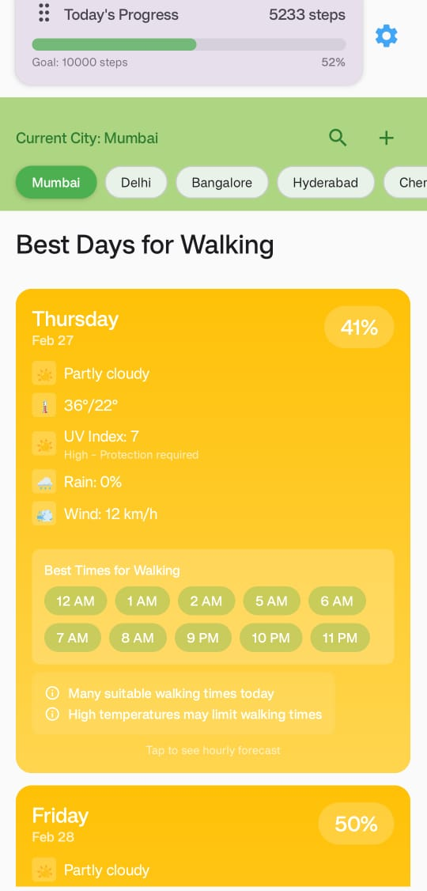
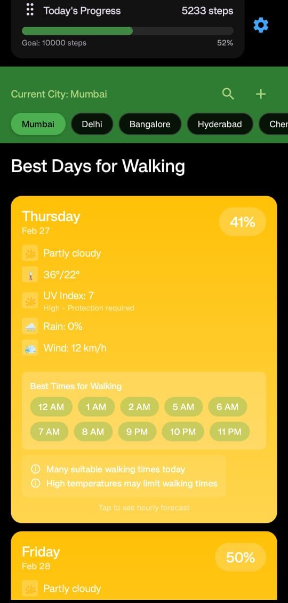

# 🚶‍♂️ WalkFit - Smart Step Counter & Weather App

<div align="center">


[](https://android-arsenal.com/api?level=26)
[](https://kotlinlang.org)
[](https://developer.android.com/jetpack/compose)
[](LICENSE)
[](https://cursor.sh)

*Your intelligent walking companion that combines fitness tracking with weather insights! 🌤️*

</div>

---

## 🌟 What Makes WalkFit Special?

WalkFit isn't just another step counter – it's your intelligent walking companion that helps you make the most of your daily walks. By combining real-time step tracking with smart weather insights, WalkFit helps you choose the perfect time for your walks.

---

## 🎯 Smart Features That Set Us Apart

- **Intelligent Walk Planning**: Get personalized recommendations for the best walking times based on weather conditions  
- **Seamless Background Tracking**: Never miss a step with our reliable background tracking service  
- **Weather-Aware Suggestions**: Receive smart notifications about optimal walking conditions  
- **Beautiful Material Design**: Enjoy a modern, intuitive interface that's a pleasure to use  

---


## ✨ Features

### 🦶 Step Tracking
- **Real-time Monitoring**: Watch your steps accumulate in real time  
- **Smart Goals**: Set and track personalized daily step goals  
- **Persistent Data**: Never lose your progress, even after app restarts  
- **Automatic Reset**: Fresh start every day at midnight  
- **Multi-Sensor Support**: Utilizes various device sensors for maximum accuracy  

### ⛅ Weather Integration
- **Live Weather Updates**: Real-time weather data at your fingertips  
- **Smart Walk Score**: Custom algorithm considers multiple weather factors  
- **Hourly Forecasts**: Plan your walks with detailed hourly predictions  
- **Multi-City Support**: Track weather in multiple locations  
- **Optimal Time Finder**: Get suggestions for the best walking times  

### 🎨 User Experience
- **Dark/Light Themes**: Choose your preferred visual style  
- **Haptic Feedback**: Enjoy satisfying tactile responses  
- **Interactive Cards**: Engaging weather and step count displays  
- **Progress Visualization**: Beautiful charts and progress indicators  
- **Smooth Animations**: Delightful micro-interactions throughout  

---

## 🛠️ Technical Architecture

### Built With Modern Tech Stack
```kotlin
val techStack = listOf(
    "Jetpack Compose" to "Kotlin-first UI toolkit",
    "Kotlin Coroutines" to "Native Kotlin async operations",
    "Kotlin Flow" to "Reactive programming in Kotlin",
    "Dagger Hilt" to "Kotlin-optimized dependency injection",
    "Material 3" to "Modern Android UI components"
)

val implementation = "100% Kotlin" // No Java code
val modernTooling = true
val kotlinFirstApproach = true

```

### 🏗️ Key Components
Pure Kotlin: Entire codebase written in modern Kotlin

StepCounter: Kotlin implementation of sensor fusion

WeatherService: Kotlin Coroutines for async weather data

BackgroundService: Kotlin service implementation

DataPersistence: Kotlin-based data storage system

📱 Screenshots
<div align="center"> <table> <tr> <td><strong>Light Theme</strong></td> <td><strong>Dark Theme</strong></td> </tr> <tr> <td>  </td> <td>  </td> </tr> </table> </div>

## 🚀 Getting Started

### Prerequisites
```bash
# Required
✓ Android Studio Hedgehog or later
✓ Android SDK 26+
✓ Kotlin 1.9.0+
```

### Installation Steps
1. **Clone the repo**
   ```bash
   git clone https://github.com/omtaywade-github/Walkfit_app.git
   ```
2. **Open in Android Studio**
3. **Build and Run**
   ```bash
   ./gradlew installDebug
   ```

## 🔒 Required Permissions

```kotlin
val requiredPermissions = listOf(
    Manifest.permission.ACTIVITY_RECOGNITION,  // Step counting
    Manifest.permission.FOREGROUND_SERVICE,    // Background operation
    Manifest.permission.INTERNET,             // Weather data
    Manifest.permission.ACCESS_FINE_LOCATION, // Location services
    Manifest.permission.RECEIVE_BOOT_COMPLETED // Auto-start capability
)
```

## 🤝 Contributing

We love contributions! Here's how you can help:

1. 🍴 Fork the Project
2. 🔨 Create your Feature Branch (`git checkout -b feature/AmazingFeature`)
3. 💾 Commit your Changes (`git commit -m 'Add some AmazingFeature'`)
4. 📡 Push to the Branch (`git push origin feature/AmazingFeature`)
5. 🎉 Open a Pull Request

## 📝 License

Distributed under the MIT License. See `LICENSE` for more information.

## 🎉 Acknowledgments

- 🤖 Developed with Cursor AI (Claude) and Android Studio
- 🌤️ Weather data by Open-Meteo API
- 🎨 Material Design 3 by Google
- 📱 Android Jetpack libraries

## 📞 Contact & Support

Om Taywade - [@omtaywade](https://github.com/om-taywade)

<div align="center">

### ⭐ Star us on GitHub — it helps!

[Report Bug](https://github.com/omtaywade-github/Walkfit_app/issues) · [Request Feature](https://github.com/omtaywade-github/Walkfit_app/issues)

</div> 
